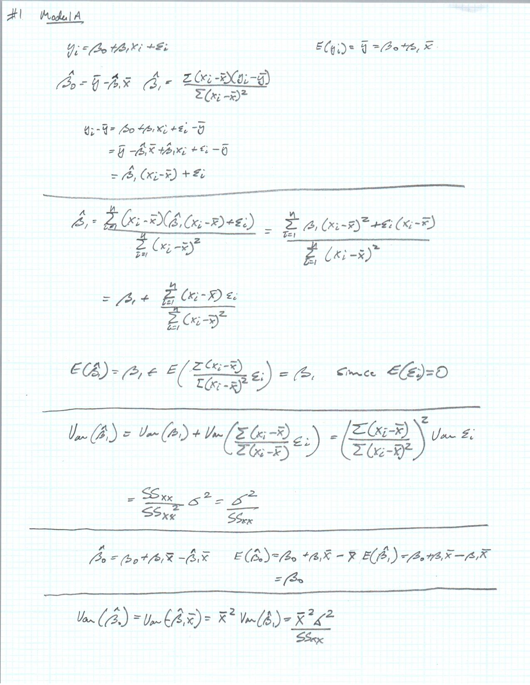
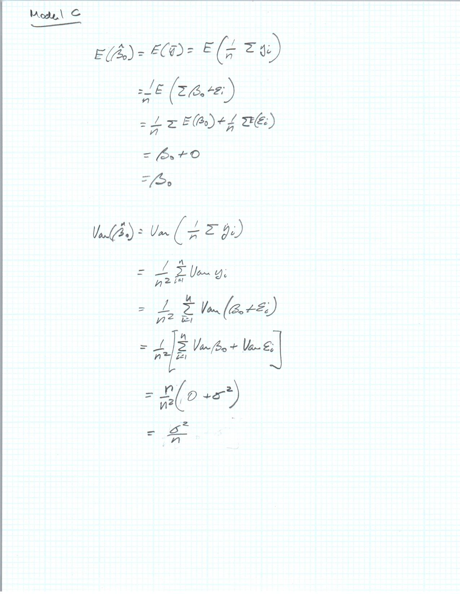
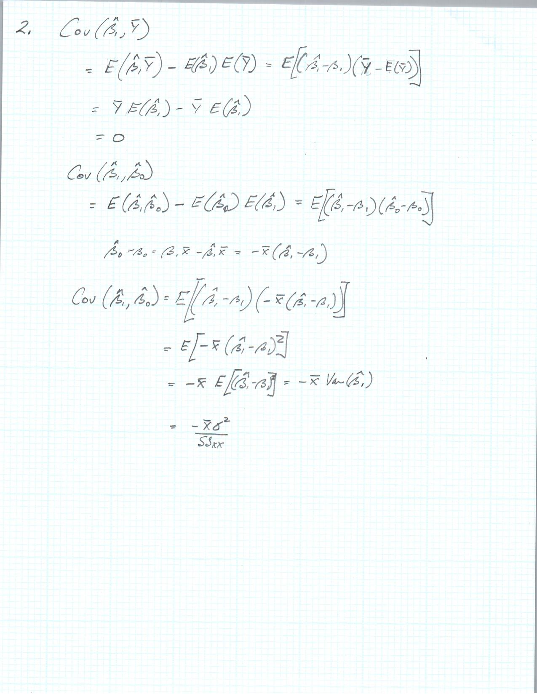
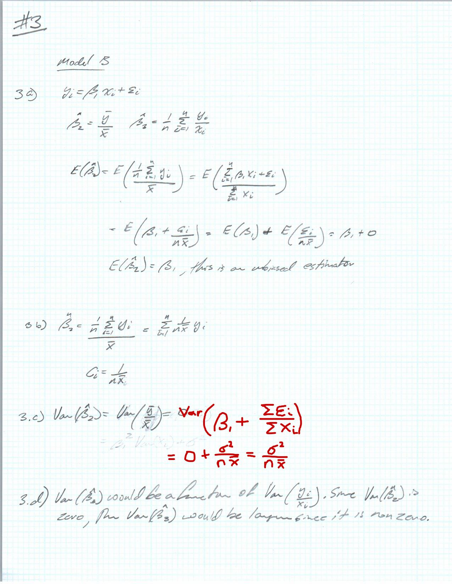
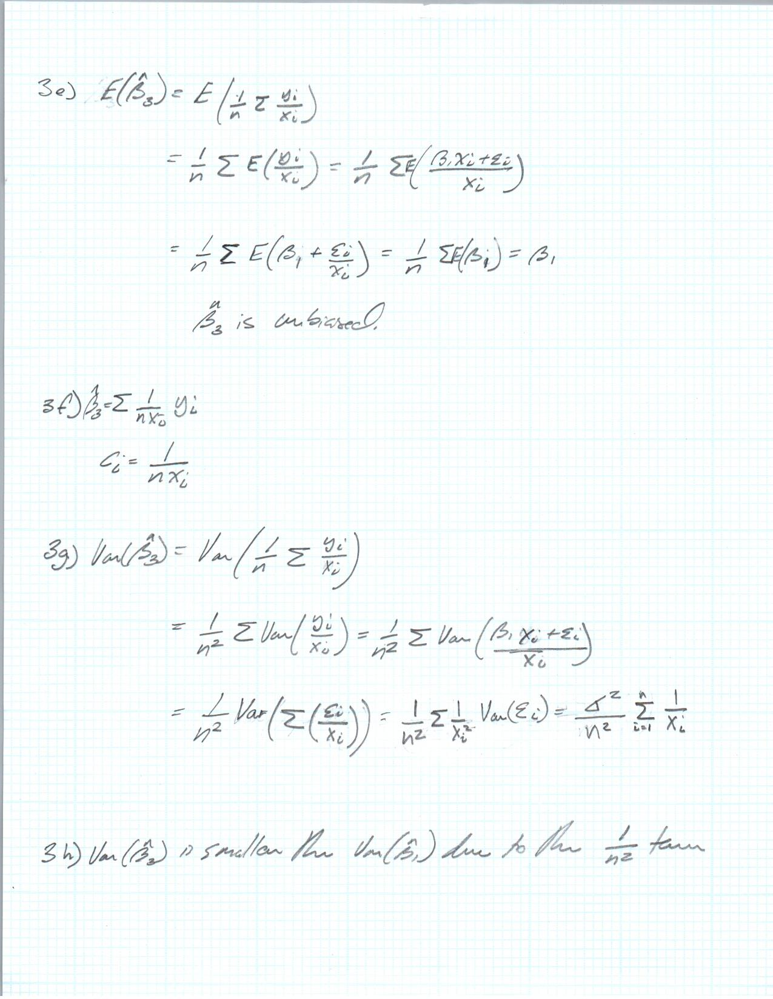

```{r setup, include=FALSE}
library(faraway)
library(tidyverse)
library(ellipse)
```









### LMR 3.4 a)

```{r echo = FALSE}
null_model1 <- lm(total ~ 1, data = sat)
#summary(null_model1)
#knitr::kable(anova(null_model1))

sat_model1 <- lm(total ~ expend + ratio + salary, data = sat)
summary(sat_model1)
print(anova(sat_model1))

SST <- sum((sat$total - mean(sat$total))^2)
SSR <- sum((sat_model1$fitted.values - mean(sat$total))^2)
SSE <- sum((sat$total - sat_model1$fitted.values)^2)
MSR <- SSR/(sat_model1$rank - 1)
MSE <- SSE/(nrow(sat) - sat_model1$rank)
df_vector <- c(sat_model1$rank - 1, nrow(sat) - sat_model1$rank, nrow(sat) - 1)
SS <- c(SSR, SSE, SST)

anova_table <- as_tibble(cbind(df_vector, SS))

anova_table <- anova_table %>% mutate(MS = SS/df_vector)

anova_table[3,3] <- NA

F_stat <- c(as.numeric(anova_table[1,3] / anova_table[2,3]), NA, NA)

p_value <- c(1 - (pf(F_stat[1], (sat_model1$rank - 1) , (nrow(sat) - sat_model1$rank))), NA, NA)

anova_table <- cbind(anova_table, F_stat, p_value)

knitr::kable(anova_table)

```

There is not enough evidence to reject the null hypothesis that $\beta_{salary}$ is zero. The p value is above the critical value of 0.025 for a two sided t test.

There is sufficient evidence to reject the null hypothesis that states $\beta_{expend}$ = $\beta_{ratio}$ = $\beta_{salary}$. The f statistic and the corresponding p value are `r F_stat[1]` and `r p_value[1]` respectively. 

Given the large p values and low $R^2$, we cannot say that the predictors had a large effect on the response variable.

\newpage

### LMR 3.4 b)

```{r echo = FALSE}
sat_model2 <- lm(total ~ expend + ratio + salary + takers, data = sat)
summary(sat_model2)
```

In the above output, we can see that the t test produces a very small p value for the new model that includes the taker predictor.

```{r echo = FALSE}
print(anova(sat_model1, sat_model2))
print(anova(sat_model2))
```

The ANOVA table between the two models shows that the taker model significantly improves the model and should be accepted in place of the model without the taker predictor. The large f statistic gives the same conclusion as the previous t test.

```{r echo = FALSE}

SST <- sum((sat$total - mean(sat$total))^2)
SSR <- sum((sat_model2$fitted.values - mean(sat$total))^2)
SSE <- sum((sat$total - sat_model2$fitted.values)^2)
MSR <- SSR/(sat_model2$rank - 1)
MSE <- SSE/(nrow(sat) - sat_model2$rank)
df_vector <- c(sat_model2$rank - 1, nrow(sat) - sat_model2$rank, nrow(sat) - 1)
SS <- c(SSR, SSE, SST)

anova_table <- as_tibble(cbind(df_vector, SS))

anova_table <- anova_table %>% mutate(MS = SS/df_vector)

anova_table[3,3] <- NA

F_stat <- c(as.numeric(anova_table[1,3] / anova_table[2,3]), NA, NA)

p_value <- c(1 - (pf(F_stat[1], (sat_model2$rank - 1) , (nrow(sat) - sat_model2$rank))), NA, NA)

anova_table <- cbind(anova_table, F_stat, p_value)

knitr::kable(anova_table)

```

We have sufficient evidence to reject the null hypothesis that $\beta_{takers}$ = 0 at the $\alpha$ level of 0.05 (p value in this case is close to zero). 

\newpage

### LMR 3.7 a)

```{r echo = FALSE}
pun_model1 <- lm(Distance ~ RStr + LStr + RFlex + LFlex, data = punting)
summary(pun_model1)
```

None of the predictors are significant at the 5% level

\newpage

### LMR 3.7 b)

```{r echo = FALSE}
null_model1 <- lm(Distance ~ 1, data = punting)
anova(null_model1, pun_model1)

SST <- sum((punting$Distance - mean(punting$Distance))^2)
SSR <- sum((pun_model1$fitted.values - mean(punting$Distance))^2)
SSE <- sum((punting$Distance - pun_model1$fitted.values)^2)
MSR <- SSR/(pun_model1$rank - 1)
MSE <- SSE/(nrow(punting) - pun_model1$rank)
df_vector <- c(pun_model1$rank - 1, nrow(punting) - pun_model1$rank, nrow(punting) - 1)
SS <- c(SSR, SSE, SST)

anova_table <- as_tibble(cbind(df_vector, SS))

anova_table <- anova_table %>% mutate(MS = SS/df_vector)

anova_table[3,3] <- NA

F_stat <- c(as.numeric(anova_table[1,3] / anova_table[2,3]), NA, NA)

p_value <- c(1 - (pf(F_stat[1], (pun_model1$rank - 1) , (nrow(punting) - pun_model1$rank))), NA, NA)

anova_table <- cbind(anova_table, F_stat, p_value)

knitr::kable(anova_table)
```

According to the value of the f statistic and the p value, there is evidence that at least one of the $\beta$ values is not zero. Therefore indicating that at least one of the predictors has an effect on the response variable.

\newpage

### LMR 3.7 c)
```{r echo = FALSE}
pun_model2 <- lm(Distance ~ RStr + LStr, data = punting)
```

Summary and ANOVA for reduced model

```{r echo = FALSE}
summary(pun_model2)
```

ANOVA table for reduced model

```{r echo = FALSE}
SST <- sum((punting$Distance - mean(punting$Distance))^2)
SSR <- sum((pun_model2$fitted.values - mean(punting$Distance))^2)
SSE <- sum((punting$Distance - pun_model2$fitted.values)^2)
MSR <- SSR/(pun_model2$rank - 1)
MSE <- SSE/(nrow(punting) - pun_model2$rank)
df_vector <- c(pun_model2$rank - 1, nrow(punting) - pun_model2$rank, nrow(punting) - 1)
SS <- c(SSR, SSE, SST)

anova_table <- as_tibble(cbind(df_vector, SS))

anova_table <- anova_table %>% mutate(MS = SS/df_vector)

anova_table[3,3] <- NA

F_stat <- c(as.numeric(anova_table[1,3] / anova_table[2,3]), NA, NA)

p_value <- c(1 - (pf(F_stat[1], (pun_model2$rank - 1) , (nrow(punting) - pun_model2$rank))), NA, NA)

anova_table <- cbind(anova_table, F_stat, p_value)

knitr::kable(anova_table)
```

According to the p values, neither RStr nor LStr have a significant effect on the the response variable. They are both above the $\alpha$ level of 0.05. Strictly comparing the p values for the two predictors, RStr does appear to have a greater effect on distance than LStr.  

\newpage

### LMR 3.7 d)

```{r echo = FALSE}
confint(pun_model2)

plot(ellipse(pun_model2, c(2,3)), type = 'l')
points(pun_model2$coefficients[2], pun_model2$coefficients[3], pch = 19)
points(0,0, pch = 4)
abline(v = confint(pun_model2)[2, ], lty = 2)
abline(h = confint(pun_model2)[3, ], lty = 2)
```

The origin is not within the ellipse, therefore we can reject $H_{0}$ of $\beta_{RStr}$ = $\beta_{LStr}$. Additionally, the origin lies within the boundaries of the 95% confident limits for both variables so we cannot reject the either null hypothesis of $\beta_{RStr}$ = 0 or $\beta_{LStr}$ = 0. This supports what was was found in Part c). In regards to which predictor has a greater effect on the response, we can see that the origin is well within the 95% CL for LStr, but closer to the limit for RStr. 

\newpage

## Code
```{r, ref.label=knitr::all_labels(),echo=TRUE,eval=FALSE}